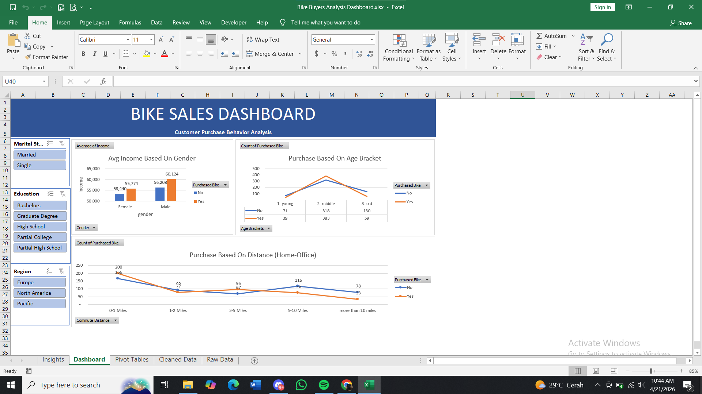
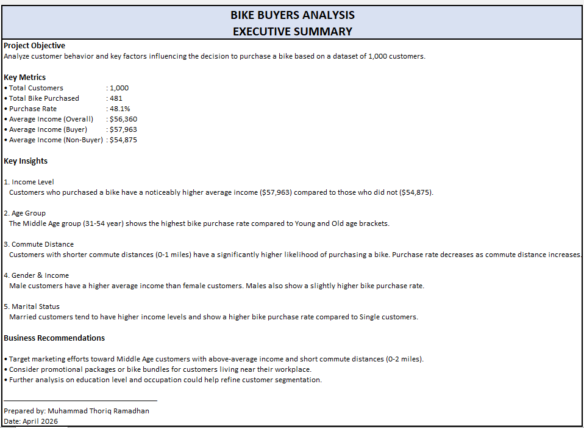

# 🚲 Bike Buyers Analysis Dashboard

**Excel Data Analysis & Interactive Dashboard** | Customer Behavior Analysis

### 📌 Project Overview
This project analyzes customer behavior and factors influencing bike purchase decisions using a dataset of 1,000 customers. The analysis includes data cleaning, pivot tables, charts, and an interactive dashboard built entirely in Microsoft Excel.

### 🎯 Key Features
- Data cleaning and preparation
- Advanced Pivot Tables and Slicers
- Interactive Dashboard with multiple filters (Marital Status, Education, Region, Age Bracket, Commute Distance)
- Key Metrics and Business Insights

### 📊 Dashboard Highlights
- Average Income by Gender and Purchase Status
- Bike Purchase by Age Bracket
- Purchase Trends based on Commute Distance
- Interactive slicers for dynamic filtering

### 🔍 Key Insights
- Higher income customers are more likely to purchase a bike
- Middle Age group shows the highest purchase rate
- Shorter commute distance strongly correlates with bike purchase
- Married customers tend to have higher income and higher purchase rate

### 📥 Download Files

**📊 Excel Workbook**
- [📥 Download Bike Buyers Analysis Dashboard.xlsx](Bike%20Buyers%20Analysis%20Dashboard.xlsx)

**📸 Dashboard Preview**

**📋 Executive Summary**

### 🛠️ Tools & Technologies
- Microsoft Excel (Advanced)
- Pivot Tables, Slicers & Dashboard Design
- Data Cleaning & Visualization
- KPI Development & Business Insights

### 🎓 Skills Demonstrated
- End-to-end Excel data analysis
- Interactive dashboard creation
- Deriving actionable business insights
- Customer segmentation analysis

---

**Made with ❤️ by Muhammad Thoriq Ramadhan**  
Aspiring Data Analyst | Excel & Tableau Specialist

*Last updated: April 2026*
